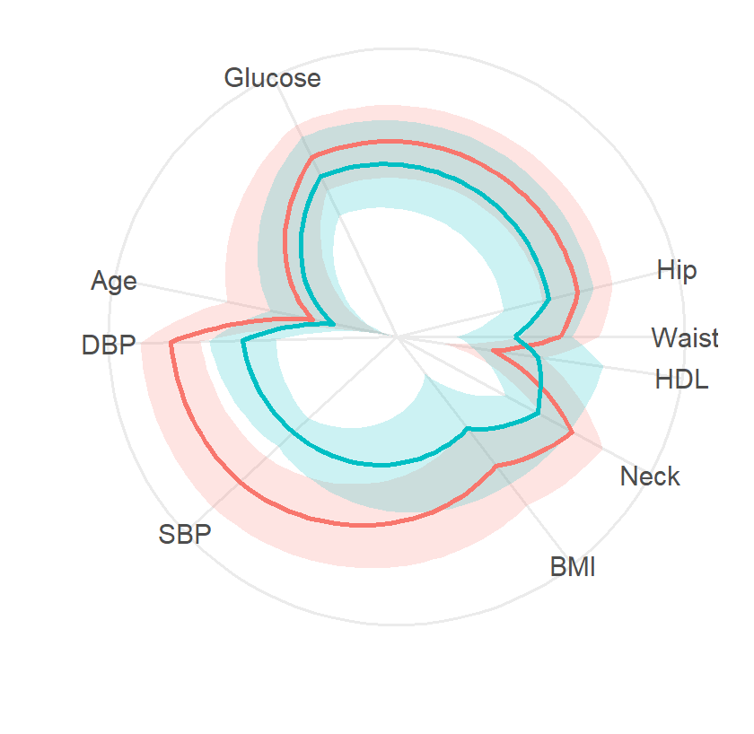

<!-- README.md is generated from README.Rmd. Please edit that file -->

```{r, include = FALSE}
knitr::opts_chunk$set(
  collapse = TRUE,
  comment = "#>",
  fig.path = "man/figures/README-",
  out.width = "100%"
)
```

# corradar: Create Correlation Based Radar Plots

<!-- badges: start -->
<!-- badges: end -->

The `corradar` R package was designed to address the limitations of typical radar plots. 

First, corradar plots use a correlation based algorithm to calculate axes positions, as opposed to axes order being set arbitrarily in typical radar plots. The ideology of this algorithm is that variables with stronger linear pair-wise correlations will be closer in proximity on the corradar plot than weak correlations.
In the example corradar plot of test patient health profiles, we can see that hip and waist measurements are generally more strongly correlated than waist measurements and age.



Corradar plots also take inspiration from parallel coordinate plots in order to normalize axis, with the center of the corradar plot being the minimum value for each variable, and the outermost ring being the maximum.

Additionally, corradar plots implement curved lines to show mean values for each variable, with shaded bands showing one standard deviation above and below, to see the approximate shape of the variable's distribution.

Corradar plots also are able to plot multiple groups of data on the same plot for comparison.


## Installation

You can install the development version of corradar from [GitHub](https://github.com/) with:

``` r
# install.packages("pak")
pak::pak("kriggithub/corradar")
```

